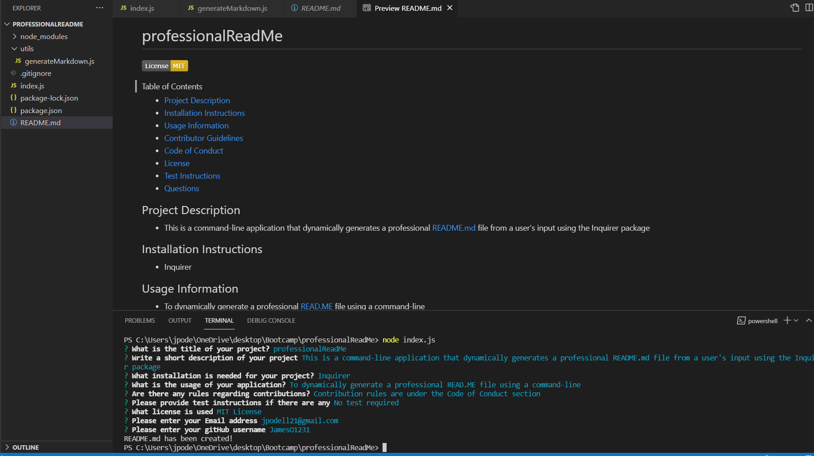

# professionalReadMe

  
#### Table of Contents
* [Project Description](#project-description)
* [Installation Instructions](#installation-instructions)
* [Usage Information](#usage-information)
* [Contributor Guidelines](#contributor-guidelines)
* [Code of Conduct](#code-of-conduct)
* [License](#license)
* [Test Instructions](#test-instructions)
* [Questions](#questions)

## Project Description
* This is a command-line application that dynamically generates a professional README.md file from a user's input using the Inquirer package

## Installation Instructions
* Inquirer

## Usage Information
* The usage is to dynamically generate a professional READ.ME file using a command-line

## Contributor Guidelines
* Contribution rules are under the Code of Conduct section

## Code of Conduct
* [Contributor Code of Conduct](https://www.contributor-covenant.org/version/2/0/code_of_conduct/code_of_conduct.md)

## Test Instructions
* No test required

## License
* MIT License

## Questions
* For additional help or questions about collaboration, please reach out to jpodell21@gmail.com
* Follow me on Github at [JamesO1231](http://github.com/JamesO1231)

## Usage Image

